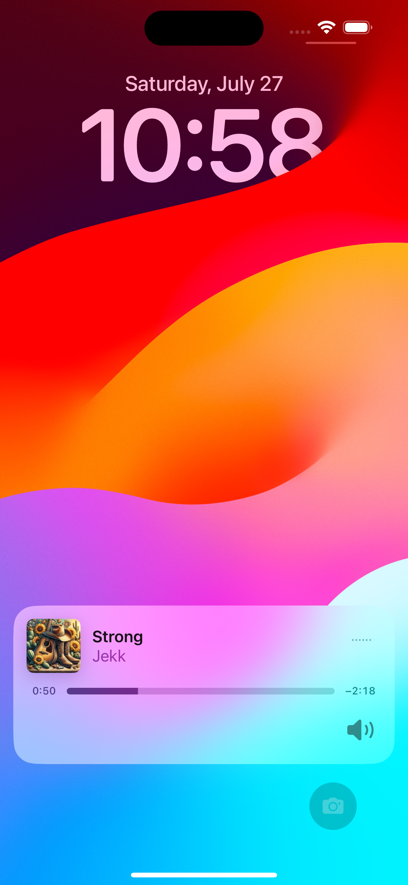

# Music Streaming App

<h1 align="center">Sangeet</h1>

A feature-rich music streaming application built with MVVM architecture.

## Features

- Login / Signup
- User authentication (login/signup)
- Song playback (play/pause)
- Song upload functionality
- Playlist management:
  - Recently played songs
  - Liked songs
- Background music playback
- Notification controls for music playback

## Upcoming Features

- Payment Gateway Integration.

## Architecture

This app follows the MVVM (Model-View-ViewModel) architecture pattern.

## SignIn / SignUp

  
  

## Home Page (Before Uploading new Songs.)

  

## Upload Songs.

  
  
  
  

## HomePage (After Uploading New Songs)

  
  
  
  

## Music Player

  
  
  
  

## Background Music Player/ Notification controls

  
  
  
  

## Like Songs

  
  

State Management:

- RiverPod. => Notifiers used - (AutoDisposeNotifierProvider, FutureAutoDisposeNotifierProvider)

Tools / frameworks used:

- Riverpod
- PostgreSQL
- Cloudinary
- Hive (Local Storage)
- SharedPrefrences (Cache data)
- JWT
- FastAPI

A few resources to get you started if this is your first Flutter project:

- [Lab: Write your first Flutter app](https://docs.flutter.dev/get-started/codelab)
- [Cookbook: Useful Flutter samples](https://docs.flutter.dev/cookbook)

For help getting started with Flutter development, view the
[online documentation](https://docs.flutter.dev/), which offers tutorials,
samples, guidance on mobile development, and a full API reference.
